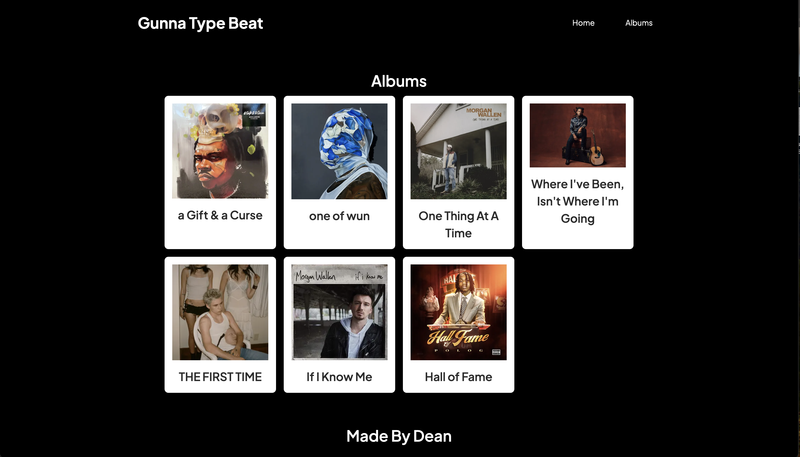

# Meloroids LLC

Welcome to **Meloroids LLC** – my playground for quickly building tools and ideas to aid in music production.

## Overview

**Meloroids LLC** is a collection of innovative tools designed for music production. Born from a passion for both technology and music, this project serves as a playground for testing out fresh ideas that help producers get more creative in the studio.



## What’s Inside?

- **Rapid Prototyping**: Experiment with new ideas and features, all within a single, unified repository.
- **Real Tools for Producers**: These aren’t just experiments—they’re actively used by me and a community of fellow producers.
- **Scalable Architecture**: Leverage the power of a mono repo to easily maintain and update multiple projects simultaneously.

## Tech Stack

- **Turbo Repo**: For a lightning-fast, scalable development environment.
- **TypeScript**: Ensuring type-safe code for robust, maintainable projects.
- **Tailwind CSS**: For modern, responsive UI design.
- **Firebase**: Powering backend services with ease and reliability.
- **Next.js & React**: Building interactive, dynamic, and performant user interfaces.

## Getting Started

To get your local environment up and running, follow these steps:

**1. Clone the repository:**

  ```bash
  git clone <https://github.com/petehod/meloroids-llc.git>
  cd meloroids-llc
  ```


**2.  Install dependencies:**

  ```bash
    # cd into each project inside of /apps and run
    npm install
  ```

**3. Run the development server**

  ```bash
  # from root
  npm run dev
  ```


All projects should be running!